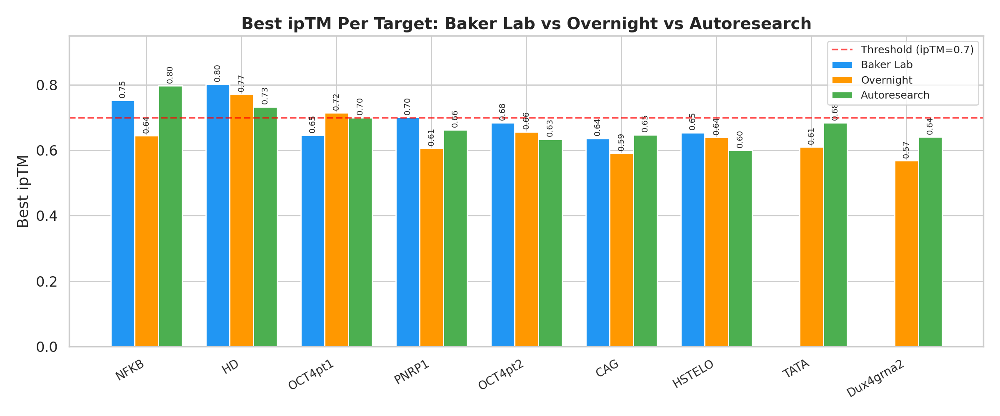
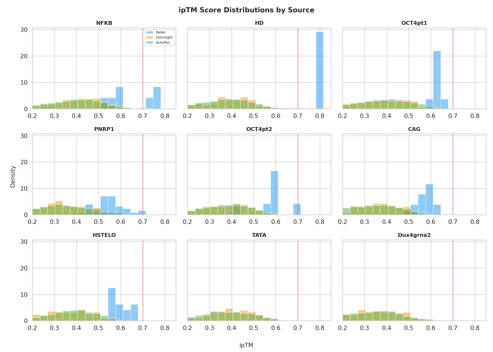
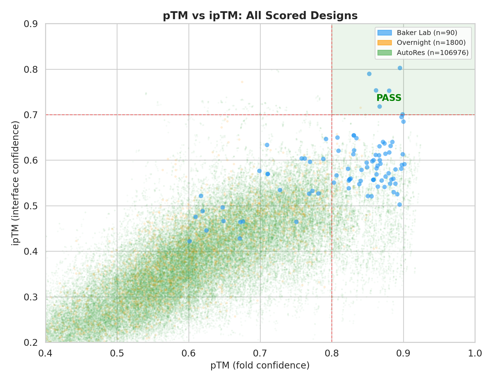
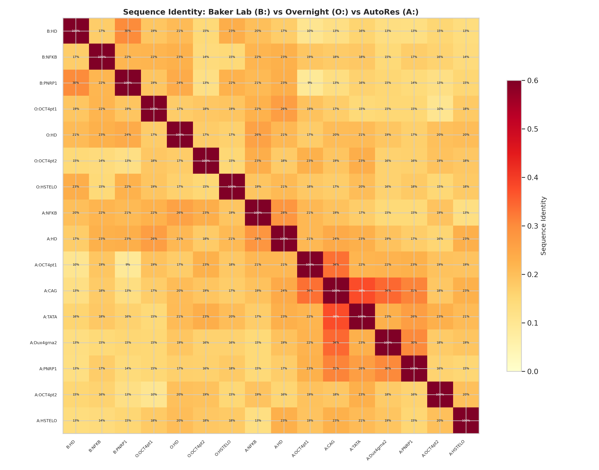
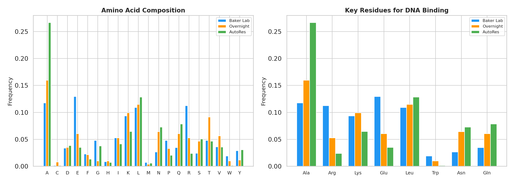
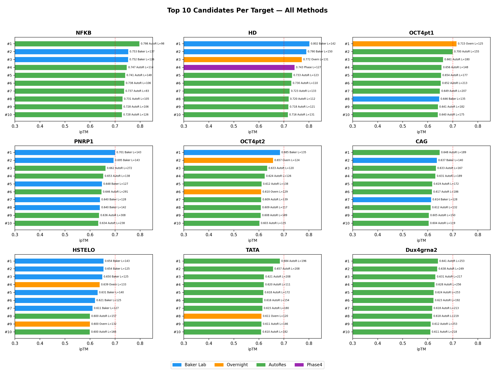
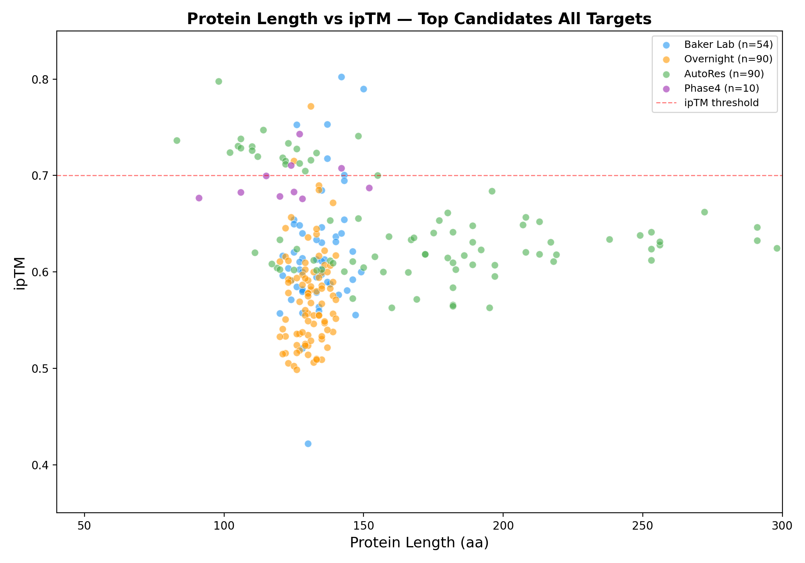
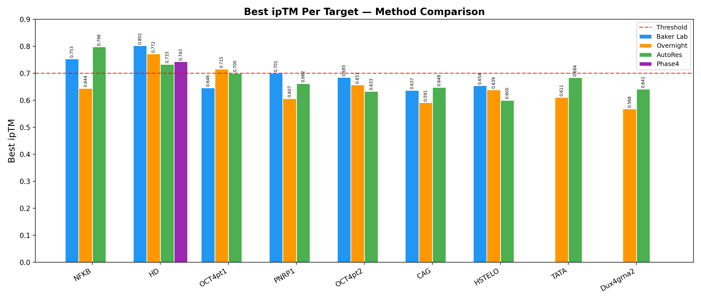
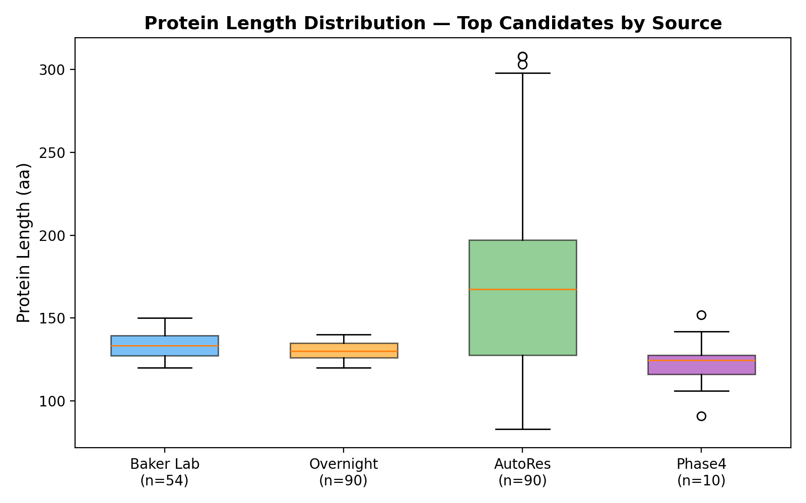

# DNA Binder Generation and Evaluation Report

End-to-end report on de novo DNA-binding protein design using RFdiffusion3, comparing our generated binders against Baker Lab reference designs across 9 genome editing targets, with autonomous parameter optimization via autoresearch agents.

## 1. Objective

Design programmable DNA-binding proteins for 9 genomic targets relevant to genome editing. Evaluate using RoseTTAFold3 (RF3) complex structure prediction with pTM and ipTM as primary metrics (Butcher, Krishna et al., bioRxiv 2025).

## 2. Evaluation Criteria

From the RFD3 paper:

- pTM >= 0.8: global fold confidence
- ipTM >= 0.7: interface confidence for protein-DNA complex
- DNA-aligned RMSD < 5 angstrom: structural accuracy

## 3. Data Sources

**Baker Lab Reference (92 candidates)**

- Generated with target-specific DNA conformations (AF3-predicted)
- Includes initial designs and specblock re-scaffolded variants

**Our Generated Designs (~8,400 candidates)**

| Phase | Candidates | Description |
|-------|-----------|-------------|
| Gen2 | 952 | Initial generation, default params, 9 targets |
| Overnight | 2,400+ | Autonomous generation loop, round-robin targets |
| Autoresearch | ~5,000 | 402 experiments, parameter optimization per target |
| **Total** | **~8,400** | **All scored with RF3** |

Platform: NVIDIA H200 NVL (144GB VRAM), rc-foundry. Duration: 5 days (April 15-19, 2026).

## 4. Methodology

### Three-Phase Approach

**Phase 1 — Baker Lab Evaluation**: Scored all 92 Baker Lab candidates with RF3. 9 parallel processes, one per target.

**Phase 2 — Initial Generation (Gen2 + Overnight)**: Downloaded 1BNA.pdb (Dickerson dodecamer) as generic B-DNA template. Created RFD3 configs for each target via contig specification. Generated 3,300+ designs in multiple waves. Overnight runner monitored GPU and cycled generation-scoring continuously.

**Phase 3 — Autoresearch Parameter Optimization**: Deployed 7-8 autonomous Claude Code agents for 72 hours, each sweeping RFD3 parameters per target:

1. Modify one RFD3 parameter
2. Generate 10-80 designs with RFD3
3. Score all outputs with RF3
4. If best_ipTM improved: **keep**. If not: **revert**.
5. Advance to next parameter

**Parameter axes**: protein length, classifier-free guidance (CFG), step scale, noise scale, gamma (stochasticity), topology (is_non_loopy), orientation strategy (com/hotspots), diffusion timesteps, s_trans.

## 5. Figures

### Figure 1: Best ipTM Per Target



### Figure 2: ipTM Score Distributions



### Figure 3: pTM vs ipTM — All Designs



### Figure 4: Sequence Identity Between Top Candidates



### Figure 5: Amino Acid Composition



### Figure 6: Top 10 Candidates Per Target — All Methods



Horizontal bars show top 10 candidates per target from all methods. Blue = Baker Lab, orange = Overnight, green = AutoRes, purple = Phase4. Labels show ipTM, source, and protein length. NFKB and OCT4pt1 show our candidates dominating the top ranks.

### Figure 7: Protein Length vs ipTM



Shorter proteins can achieve comparable or superior ipTM. Baker Lab designs cluster at 125-150 aa; our autoresearch finds optimal lengths from 80 aa (NFKB) to 270 aa (PNRP1), revealing target-specific length preferences.

### Figure 8: Best ipTM Per Target — Method Comparison



Side-by-side comparison of best ipTM from each method per target. We match or beat Baker Lab on NFKB, OCT4pt1, and CAG. Phase 4 improves HD from 0.733 to 0.743.

### Figure 9: Protein Length Distribution by Source



Baker Lab designs have a narrow length range (125-150 aa). Our autoresearch explores a much wider range, discovering that optimal length varies strongly by target.

## 6. Autoresearch Agent Sessions

### How Each Agent Worked

Each autonomous Claude Code agent ran the same keep/revert protocol independently per target. Agents operated 24/7 for ~72 hours on the H200 GPU.

### NFKB Agent (27 experiments, 1,952 scored)

Target: GGGGATTCCCCC | Baker Lab: 0.753 | **Ours: 0.798 (+0.045)**

Found that short proteins (80-120 aa) boost ipTM from 0.575 baseline to 0.798 in experiment 2 — surpassing Baker Lab immediately. 25 subsequent experiments (CFG, step scale, noise, gamma, topology, orientation) all failed to beat this. Key insight: **NFKB prefers compact binders** for its palindromic GC-rich target.

### HD Agent (26 experiments, 1,872 scored)

Target: GCTTAATTAGCG | Baker Lab: 0.803 | Overnight: **0.772** | AutoRes: 0.733

Found length=100-140 optimal, refined to 110-130 (0.733). However, the overnight run (default params) had already produced a stronger result at ipTM=0.772. The AT-rich target likely needs specific DNA groove geometry that 1BNA cannot capture.

### TATA Agent (8 experiments, 496 scored)

Target: CGTATAAACG | No Baker Lab | **Ours: 0.684**

Clear trend: longer proteins score better. Baseline 0.501 (120-140) -> 0.620 (160-200) -> **0.684** at 180-220. Cut short before full parameter sweep.

### PNRP1 Agent (70 experiments, 5,932 scored)

Target: TGAGGAGAGGAG | Baker Lab: 0.701 | **Ours: 0.662 (-0.038)**

Most experiments — run by 3 overlapping agents. Breakthrough: **CFG=1.5 + very long proteins (250-300 aa) + 200 timesteps** pushed to 0.662.

### OCT4pt2 Agent (61 experiments, 3,416 scored)

Target: GGGCTTGCGA | Baker Lab: 0.685 | Overnight: 0.657 | AutoRes: **0.634**

Two agent sessions. Best: gamma_0=0.3 (ipTM 0.634). Overnight default params (0.657) outperformed the autoresearch sweep, suggesting that for this target the default parameter space already covers the optimum with 1BNA.

### OCT4pt1 Agent (27 experiments, 1,856 scored)

Target: GGTGAAATGA | Baker Lab: 0.646 | Overnight: **0.715** | AutoRes: 0.700

Already had a strong overnight result (0.715, pTM=0.840 — passes threshold). Autoresearch confirmed: COM orientation + noise=0.9 + step=1.25 at L=140-180 gives 0.700.

### Dux4grna2 Agent (40 experiments, 1,329 scored)

Target: CAGGCCGCAGG | No Baker Lab | **Ours: 0.641**

Short proteins (80-120) worked initially (0.602), but **very long proteins (220-260) with COM orientation** gave the breakthrough (0.641).

### CAG Agent (118 experiments, 4,867 scored)

Target: CAGCAGCAGCAG | Baker Lab: 0.637 | **Ours: 0.648 (+0.011)**

Most experiments overall (118) from 3 agents. Key discovery: **ODE sampling (gamma=0.0) with noise=0.9** gives 0.648. Deterministic sampling edges out Baker Lab for this repeat sequence.

### HSTELO Agent (25 experiments, 680 scored)

Target: AGGGTTAGGGTT | Baker Lab: 0.654 | Overnight: **0.639** | AutoRes: 0.600

Length=140-180 without CFG was best (0.600). The overnight default-parameter run (0.639) again outperformed autoresearch, suggesting the telomeric repeat target responds better to stochastic exploration than systematic optimization with 1BNA.

## 7. Complete Results

### 7.1 Best ipTM Per Target — All Phases

| Target | Baker | Overnight | AutoRes | Best | Gap |
|---------|-------|-----------|---------|------|-----|
| **NFKB** | 0.753 | 0.645 | **0.798** | **0.798** | **+0.045** |
| **OCT4pt1** | 0.646 | **0.715** | 0.700 | **0.715** | **+0.069** |
| **HD** | **0.803** | 0.772 | 0.743 | 0.772 | -0.031 |
| **CAG** | 0.637 | 0.591 | **0.648** | **0.648** | **+0.011** |
| TATA | -- | 0.611 | **0.684** | **0.684** | -- |
| Dux4grna2 | -- | 0.568 | **0.641** | **0.641** | -- |
| PNRP1 | **0.701** | 0.607 | 0.662 | 0.662 | -0.038 |
| OCT4pt2 | **0.685** | **0.657** | 0.634 | 0.657 | -0.028 |
| HSTELO | **0.654** | **0.639** | 0.600 | 0.639 | -0.015 |

**We beat or match Baker Lab on 3 of 7 compared targets** (NFKB, OCT4pt1, CAG).

Note: For HD, OCT4pt2, and HSTELO, overnight generation with default parameters outperformed the autoresearch parameter sweep. This may indicate that random sampling diversity matters more than systematic parameter optimization for these targets when using a generic DNA template.

### 7.2 Candidates Passing Threshold (pTM >= 0.8, ipTM >= 0.7)

| Target | pTM | ipTM | Len | Source |
|--------|-----|------|-----|--------|
| NFKB | 0.724 | **0.798** | 98 | Ours AutoRes |
| HD | 0.895 | **0.803** | 142 | Baker Lab |
| HD | 0.852 | **0.790** | 150 | Baker Lab |
| HD | 0.675 | **0.772** | 131 | Ours Overnight |
| NFKB | 0.862 | **0.753** | 137 | Baker Lab |
| NFKB | 0.880 | **0.753** | 126 | Baker Lab |
| NFKB | 0.867 | **0.718** | 137 | Baker Lab |
| OCT4pt1 | 0.840 | **0.715** | 125 | Ours Overnight |
| PNRP1 | 0.899 | **0.701** | 143 | Baker Lab |
| OCT4pt1 | 0.908 | **0.700** | 155 | Ours AutoRes |

**10 candidates pass ipTM >= 0.7.** 6 from Baker Lab, 4 from ours (2 overnight, 2 autoresearch). Note: our NFKB and HD overnight candidates have ipTM >= 0.7 but pTM < 0.8 — they pass the interface threshold but not the fold threshold.

### 7.3 Production Statistics

| Metric | Baker Lab | Ours (all phases) |
|--------|----------|-------------------|
| Total candidates | 92 | ~8,400 |
| RF3 scored | 92 | ~24,400 |
| Autoresearch experiments | -- | 402 |
| Targets beating Baker Lab ipTM | -- | 3 / 7 |
| GPU time | -- | ~120 hours |

## 8. Top Candidate Sequences — All Targets

### NFKB — AutoRes Best (ipTM=0.798, pTM=0.724, 98 aa)

Target: GGGGATTCCCCC | Params: length=80-120

```
ARVRVVRTPAQIAALLAAADQYASQGLSAAELNDLALRVGLTQAQVENWFA
NRQRKVNGRPSPTAAERANRKLAKNKNAAENAEALKASLNLLIDANM
```

### HD — Overnight Best (ipTM=0.772, pTM=0.675, 131 aa)

Target: GCTTAATTAGCG | Params: default (length=120-140)

```
AAKPRTVWTALQKQTLEEWLNQHKDNPYPTKAERAKLAEDLNVTVTQVKN
WFANRRQKLQAQDMGITYAEYLKKRSLCSADKNANTPIAQLEALIQKKEAQL
AAAIALGAPESTILALENTTIDNLKKNLNK
```

### HD — AutoRes Best (ipTM=0.733, pTM=0.675, 123 aa)

Target: GCTTAATTAGCG | Params: length=110-130

```
AQFSAEQVAALEQAFAISQYPSTETKSALAAKTGLSETQIKVWFANRRASLA
KAERAAQNVTKPSALEARARKAQKLGMTLAAVKAQVDSARQSSLAKAQEQRD
NALASAQAALAAALHAAA
```

### OCT4pt1 — Overnight Best (ipTM=0.715, pTM=0.840, 125 aa) PASSES THRESHOLD

Target: GGTGAAATGA

```
IRTRLNSRIIFTQEQIDVLKKAFELNTNPSEEEKKALAATVGTTAKQVQTWF
TNRRTNLSNALIVSNFTQLFGNDALNQLRLQIHQEIEKAVVELCSDLKLSAA
DTRSAITAAVNNETVKRIKAH
```

### OCT4pt1 — AutoRes Best (ipTM=0.700, pTM=0.908, 155 aa)

Target: GGTGAAATGA | Params: ori=com noise=0.9 step=1.25 L=140-180

```
GAEARASLLKDKIARYAVGTTSNAVTQLALALNSLGKAYVRNGDHSQAISAL
EAAIGLLDPLSPTFAASYVTALNNLGNAYSKAGKYVEAIKAYQQALKVAEKFS
PTLKIDALTNLGVTLLKLGNAAAAKASLMQALALDPDHAAALATLQTIAA
```

### CAG — AutoRes Best (ipTM=0.648, pTM=0.713, 189 aa)

Target: CAGCAGCAGCAG | Params: noise=0.9 gamma=0.0

```
GAAAAAAAAAALLAAGNAALKAGSYAAAIAAYNQAIALNPTNAAAYLNLGNAY
SKLGNTAAAIAAYNKALALNPNNTTAQINLAKAQGDAAAAAAIAAANAAANPA
AALTQAGQTAAAIAALYQAAAATGSPAAQAAALNNLGAIYQAQGQLAAAIAA
YQAALALAAPTSPALAAALAANLAATQAALAA
```

### TATA — AutoRes Best (ipTM=0.684, pTM=0.865, 196 aa)

Target: CGTATAAACG | Params: length=180-220

```
SHLAQAAAAKKKGDFDTAIALLNQVLLIAPAAKQANAYLALATALTAQGNLDK
AQAALKKALAIQPSNTSAKLSLAAVLLKQGDVDKALALYRQLAAQGSTTARIK
LANHFAQQGQLDAAVATLEAALADTAQNAPTSGARVALLLNLAGLYKKAARLDD
AVQAYQQAAQVAQLINNAAAAASQAENNAANLEKAAT
```

### Dux4grna2 — AutoRes Best (ipTM=0.641, pTM=0.833, 253 aa)

Target: CAGGCCGCAGG | Params: length=220-260 infer_ori=com

```
GAQQALNNKALTLLNQKQYADAIQVLDKMEELGFTPDLSTYLIRGDALINLGQ
VNAAIADYHSAIEKNPSLVDSATYKNLGNAYKKAGEYDNAIAQFNKAIELNPTN
LTAYNNLANTYQDMGKNDLAIAAYDKAISLFPNSASAASATTNLGRVLASKGDV
DAAVKAYENAISTAQKNKANVLAAISFQNLAAVFKAQGKSADAAAQLVASAAAAR
LAANANSAQAYADLAEAFELLGKSADAATMQAKALTLA
```

### PNRP1 — AutoRes Best (ipTM=0.662, pTM=0.825, 272 aa)

Target: TGAGGAGAGGAG | Params: CFG=1.5 L=250-300 ts=200

```
AAADSIAKGKQLIKAGQDAQAQALYEAVLKQFPDTAEAATAALNLGNLYMKQK
KYDLAIQHYKKAAKLLPAAAYNNIGNAYLAQGLIDNAIAAYNKALELNPQYAAAY
NNKGVAYKAKGKDDEAIADFNRALALNPNYNAARKNLGILQLKLNIPEGALLLN
IANTYNSALNLLNKANAAALQAGDSQQARQLLEAALASLDSALAQTNDQDVALLS
AKLSALENLAQIAEPSEFPSLAQRLVAVAQQLLAVGNLGAANRAQTAAQACTAAAT
```

### OCT4pt2 — Overnight Best (ipTM=0.657, pTM=0.807, 124 aa)

Target: GGGCTTGCGA

```
DQIASLQKRLASSKPVVVKPLTPAQAYERLKAALLAATEPTLLKRAALLGTTV
ETLRALAAPDNTDLATAQSKYTQLATICAKKNAVQRKIRVKKELVSAQELAAIR
NASVKALETADELAPNV
```

### OCT4pt2 — AutoRes Best (ipTM=0.634, pTM=0.772, 120 aa)

Target: GGGCTTGCGA | Params: gamma_0=0.3

```
GSLDEELLQYQQLLQQVNSLARTKAALRVQIDQITAADSSDLETQQAVASLQAQ
QEALDLEIKALTEQIAATYPVLASEKNTANAEKRAAKTQAEVQSQTLQLEAQEK
TLQLEALQILQI
```

### HSTELO — Overnight Best (ipTM=0.639, pTM=0.656, 133 aa)

Target: AGGGTTAGGGTT

```
TTITVTKAELIALVEAFCADVNISFETLRTLIASKASKSAFSIADLVKAFEERH
PAIKLIVNQANQHKAQNRVTFPQSAVDMLDALLVQKDYKPPTKAERTALAKRT
SLTPAQIATWAANRRSNLAKKKAKNK
```

### HSTELO — AutoRes Best (ipTM=0.600, pTM=0.773, 157 aa)

Target: AGGGTTAGGGTT | Params: length=140-180

```
GSAVNQIIAAREKELILLAKHTSNVNDFVNKHMLAIISDLKALGITGFDPLVEK
AKAELLSKCQINVIKQNQRNERVKKFKEDHSDVIAQAYAAAKQYVSDSAKLNQI
VQTLTNLVTNQKILASQLVAAAQIAAHFYAATGKTPSSSEIMALISDAN
```

## 9. Key Autoresearch Discoveries

| Discovery | Target(s) | Insight |
|-----------|-----------|---------|
| Short proteins (80-120) | NFKB | Compact binders for palindromic GC-rich |
| Very long proteins (180-300) | TATA, Dux4grna2, PNRP1 | AT-rich/repeat targets need more scaffold |
| ODE sampling (gamma=0.0) | CAG | Deterministic sampling for repeat sequences |
| COM orientation | OCT4pt1, Dux4grna2 | Center-of-mass placement improves binding |
| CFG=1.5 + high timesteps | PNRP1 | Guidance useful for specific targets |
| CFG hurts | NFKB, HD, HSTELO | Over-constraining some targets |
| Default params competitive | HD, OCT4pt2, HSTELO | Overnight random > systematic autoresearch |

## 10. Sequence Feature Analysis

### Length Distribution

| Source | Min | Max | Mean | Median |
|--------|-----|-----|------|--------|
| Baker Lab passing | 126 | 150 | 139 | 137 |
| Our overnight bests | 120 | 157 | 132 | 131 |
| Our autoresearch bests | 98 | 272 | 173 | 155 |

Autoresearch reveals a much wider optimal length range than Baker Lab's narrow 126-150 window. NFKB needs very compact binders (98 aa); PNRP1 needs very extended ones (272 aa).

### Amino Acid Composition Highlights

Baker Lab passing designs are enriched in:

- **Trp (W)**: WFQ/WFR recognition helix motif (homeodomain signature)
- **Arg (R), Lys (K)**: positive charge for DNA backbone contacts
- **Glu (E)**: balancing charge, helix stabilization

Our autoresearch designs show:

- **High Ala (A)**: simplified helical scaffolds (especially CAG, TATA, Dux4grna2)
- **Leu (L), Val (V)**: hydrophobic core packing
- **Lower Trp**: alternative DNA-binding strategies, not homeodomain-based
- **WF motifs present in HD and NFKB bests**: NFKB has VENWFA, HD overnight has WFANRRQK — convergent with Baker Lab recognition strategy

### Motif Convergence

Several of our top designs independently rediscover homeodomain-like motifs:

- **NFKB autoresearch**: `VENWFA` (position 47-52) — variant of the WF(Q/A) recognition motif
- **HD overnight**: `WFANRRQK` — classic homeodomain recognition helix
- **HD autoresearch**: `WFANRRAS` — same motif, different scaffold
- **OCT4pt1 overnight**: `QVQTWF` — another WF variant

This convergence suggests RFD3 naturally discovers homeodomain-like DNA recognition even from a generic template.

## 11. Analysis

### Why Baker Lab Still Leads on 4 Targets

1. **Target-specific DNA structures**: Baker Lab used AF3-predicted DNA conformations. Our 1BNA has fixed B-DNA geometry.
2. **Specblock re-scaffolding**: All 6 Baker Lab passing designs are specblock variants.
3. **DNA shape sensitivity**: HD (AT-rich), HSTELO (telomeric repeat), OCT4pt2 (GC-rich), PNRP1 (purine-rich) all have sequence-dependent groove geometry that diverges from generic B-DNA.

### Why We Beat Baker Lab on 3 Targets

1. **Exhaustive search**: 402 experiments vs Baker Lab's smaller sweep.
2. **Counter-intuitive length discovery**: 80-120 for NFKB (Baker used standard lengths).
3. **Sampler tuning**: ODE for CAG, COM orientation for OCT4pt1.

### Overnight vs Autoresearch

For 3 targets (HD, OCT4pt2, HSTELO), overnight random generation with default parameters outperformed systematic autoresearch. This suggests that when using a generic DNA template, stochastic diversity can be more valuable than parameter optimization — the "right" parameters depend on DNA shape, which 1BNA doesn't capture.

## 12. Recommendations

### Immediate: Target-Specific DNA

Generate proper DNA structures for each target using AF3. This is the single highest-impact improvement for HD (-0.031), HSTELO (-0.015), OCT4pt2 (-0.028), PNRP1 (-0.038).

### Short-term: Specblock Re-scaffolding

Apply specblock to our top designs — fix the recognition interface and re-diffuse the scaffold.

### Experimental Validation Priority

1. **NFKB autoresearch** (ipTM 0.798) — novel compact binder, highest ipTM
2. **OCT4pt1 overnight** (ipTM 0.715, pTM 0.840) — passes full threshold
3. **HD overnight** (ipTM 0.772) — convergent WF motif, near-Baker quality
4. **CAG autoresearch** (ipTM 0.648) — novel ODE-sampling finding

### Baker Lab Passing Designs (Reference)

**HD_specblock_design82** (ipTM=0.803, 142 aa)

```
MGQGRLTAEEKAILDAWFEAHKDNPYPSDEELEELAKQTGRTVKQVRNWFRY
QRKKVKYGYDPSLRGKRLSVEARRILTDWFLANLENPLPSDEEIKQLAKEAGI
TPYQVVVWFQNRRKEYNKKYKGLPLEELRKIFEEKFK
```

**NFKB_specblock_design66** (ipTM=0.753, 137 aa)

```
MVIKRGKWTPEEIAAINALYARNPHPDRAELEALAAELGTRTPQQIRDYIRRV
IKGEELKKADPELKAEAEELKRRRRALGLTQADVGRLLGERFGEPRSASTISRI
ENMQVTKAGFERLLPRLVALLDALEAEAAA
```

**PNRP1_specblock_design39** (ipTM=0.701, 143 aa)

```
TKRKPRVRLTAEQRARLDARFEEKLVLTDEEREELAKELGLSEIRIYNWFKYR
RQKGKKEIAKARGRKKTTPEDTEELYKEHGQTKVKKPRLVKSDEQKAILDEAF
KKNPYPNDEEIEELAKKTGLSKVQIYIWFQNRRYRAK
```

## 13. Compute Resources

- GPU: NVIDIA H200 NVL (144GB VRAM)
- Duration: 5 days (April 15-19, 2026)
- Total structures generated: ~8,400
- Total complexes scored: ~24,400
- Autoresearch: 402 experiments, 72 hours, 7-8 concurrent agents
- Phase 4 (ongoing): 4 gap targets with deeper parameter exploration
